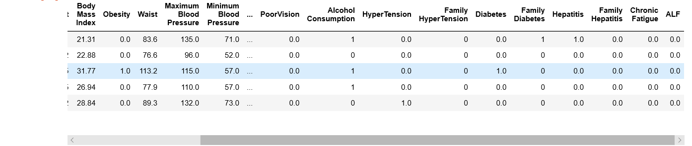

# Acute Liver Failure Patients Analysis
Acute liver failure is loss of liver function that occurs rapidly, usually for a person who has no pre existing liver disease.The JPAC centre for Health Diagnosis and control has conducted nationwide surveys of Indian adults from 1990. The centre had collected wide variety of health information through different modes. This dataset has information of 8785 adults 20 years of age or older from 2008-2009 and 2014-2015 surveys.

The dataset has been downloaded from Kaggle website. The link is :
https://www.kaggle.com/rahul121/acute-liver-failure

The steps done in this analysis are as follows:
1) Data collectiom
2) Data analysis
3) Data visualization
4) Data cleaning
5) Algorithm selection
6) Prediction
7) Saving the model

### Importing libraries:
```
import pandas as pd
import seaborn as sb
from matplotlib.pyplot import scatter as sm
import matplotlib.pyplot as plt
from sklearn.model_selection import train_test_split as tts
from sklearn.linear_model import LogisticRegression
from sklearn.metrics import confusion_matrix

```

## 1) Data Collection
###Data collection is the process of gathering and measuring information from the dataset.
```
data=pd.read_csv("C:\\Users\\Pavan R Shetty\\Desktop\\Project\\Acute Liver Failure.csv")
```
## 2) Data Analysis

### a) This displays the entire dataset.
```
data       
```


### b) This displays the first 5 entries of the dataset.
```
data.head()
```


### c) This displays the last 5 entries of the dataset.
```
data.tail()
```


### d) This shows the statistical information about the data
```
data.describe()
```


### e) This gives the count of non empty rows of each column.This means there are some null values in the dataset. There are null values in many columns.
```
data.info()

<class 'pandas.core.frame.DataFrame'>
RangeIndex: 8785 entries, 0 to 8784
Data columns (total 30 columns):
Age                       8785 non-null int64
Gender                    8785 non-null object
Region                    8785 non-null object
Weight                    8591 non-null float64
Height                    8594 non-null float64
Body Mass Index           8495 non-null float64
Obesity                   8495 non-null float64
Waist                     8471 non-null float64
Maximum Blood Pressure    8481 non-null float64
Minimum Blood Pressure    8409 non-null float64
Good Cholesterol          8768 non-null float64
Bad Cholesterol           8767 non-null float64
Total Cholesterol         8769 non-null float64
Dyslipidemia              8785 non-null int64
PVD                       8785 non-null int64
Physical Activity         8775 non-null float64
Education                 8765 non-null float64
Unmarried                 8333 non-null float64
Income                    7624 non-null float64
Source of Care            8785 non-null object
PoorVision                8222 non-null float64
Alcohol Consumption       8785 non-null int64
HyperTension              8705 non-null float64
Family  HyperTension      8785 non-null int64
Diabetes                  8783 non-null float64
Family Diabetes           8785 non-null int64
Hepatitis                 8763 non-null float64
Family Hepatitis          8779 non-null float64
Chronic Fatigue           8750 non-null float64
ALF                       6000 non-null float64
dtypes: float64(21), int64(6), object(3)
memory usage: 2.0+ MB
``` 

### f) This shows if there are missing values in the dataframe.
```
data.isnull()
```


### g) This shows if there are any missing values in each column of the dataset. True means there are null values in that column and false means there are no missing values.
```
data.isnull().any()

Age                       False
Gender                    False
Region                    False
Weight                     True
Height                     True
Body Mass Index            True
Obesity                    True
Waist                      True
Maximum Blood Pressure     True
Minimum Blood Pressure     True
Good Cholesterol           True
Bad Cholesterol            True
Total Cholesterol          True
Dyslipidemia              False
PVD                       False
Physical Activity          True
Education                  True
Unmarried                  True
Income                     True
Source of Care            False
PoorVision                 True
Alcohol Consumption       False
HyperTension               True
Family  HyperTension      False
Diabetes                   True
Family Diabetes           False
Hepatitis                  True
Family Hepatitis           True
Chronic Fatigue            True
ALF                        True
dtype: bool
```

### h) This gives the count of the null values in each column .Max number of null values is in the target variable column which is ALF.
```
data.isnull().sum()

Age                          0
Gender                       0
Region                       0
Weight                     194
Height                     191
Body Mass Index            290
Obesity                    290
Waist                      314
Maximum Blood Pressure     304
Minimum Blood Pressure     376
Good Cholesterol            17
Bad Cholesterol             18
Total Cholesterol           16
Dyslipidemia                 0
PVD                          0
Physical Activity           10
Education                   20
Unmarried                  452
Income                    1161
Source of Care               0
PoorVision                 563
Alcohol Consumption          0
HyperTension                80
Family  HyperTension         0
Diabetes                     2
Family Diabetes              0
Hepatitis                   22
Family Hepatitis             6
Chronic Fatigue             35
ALF                       2785
dtype: int64

```

### i) Replacing M with 0 and F with 1.
```

classes={'M':0,'F':1}
data.replace(classes,inplace=True)
data.head()

```




# 3) Data Visualization

## a) Bargraph to determine how many people have and do not have acute liver failure.
```
sb.countplot(data['ALF'])
```


## b) Count of patients having acute liver failure and not having acute liver failure.
```
data['ALF'].value_counts()
0.0    4035
1.0     287
Name: ALF, dtype: int64
```

## c) Bargraph to determine the gender of the patients
```
sb.countplot(data['Gender'])
```


## d) Pairplot to show the relation between all the attributes.
```
sb.pairplot(data,hue='ALF',height=7,markers=['o','D'],diag_kind='kde',kind='reg')
```

![](
